# NFT合约交互逻辑流程图和说明

## 概述

本文档详细描述了NFT项目中智能合约交互的完整逻辑流程，包括NFT铸造、市场交易、授权管理等核心功能的实现机制。

## 整体架构图

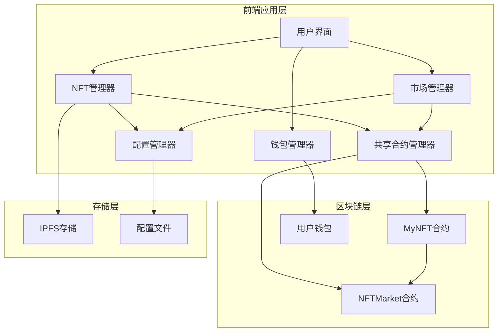

## 1. NFT铸造流程

### 1.1 铸造时序图

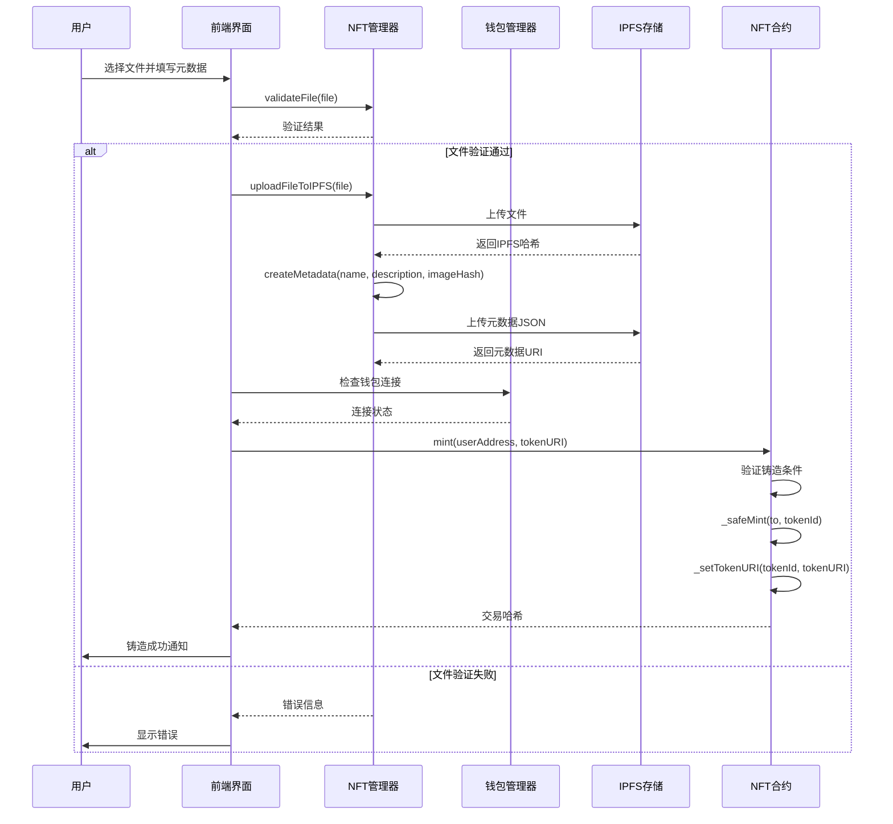

### 1.2 铸造核心逻辑

#### 前端验证流程
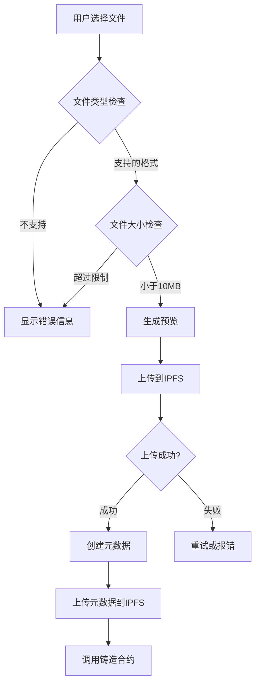

#### 智能合约验证流程
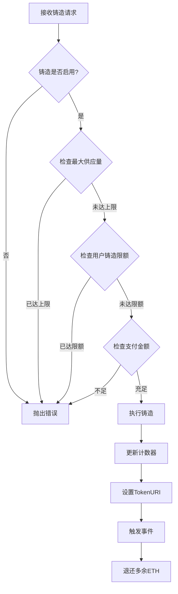

## 2. NFT市场交易流程

### 2.1 上架NFT流程

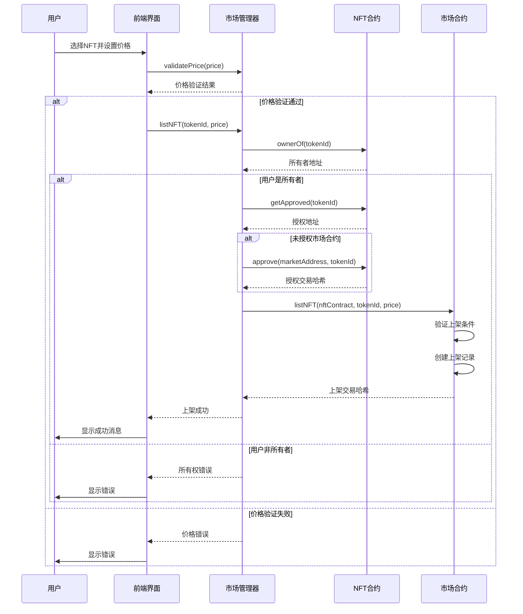

### 2.2 购买NFT流程

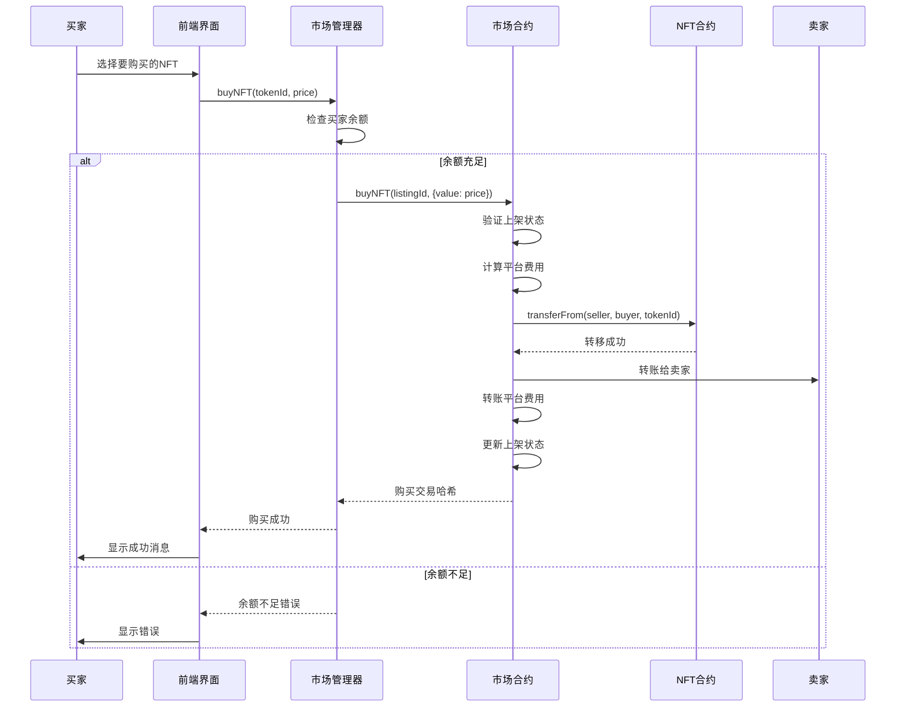

## 3. 授权管理流程

### 3.1 NFT授权机制

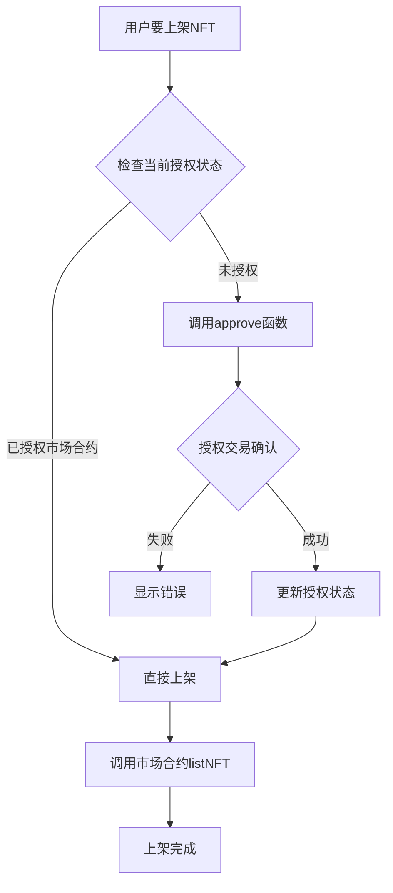

### 3.2 授权状态检查

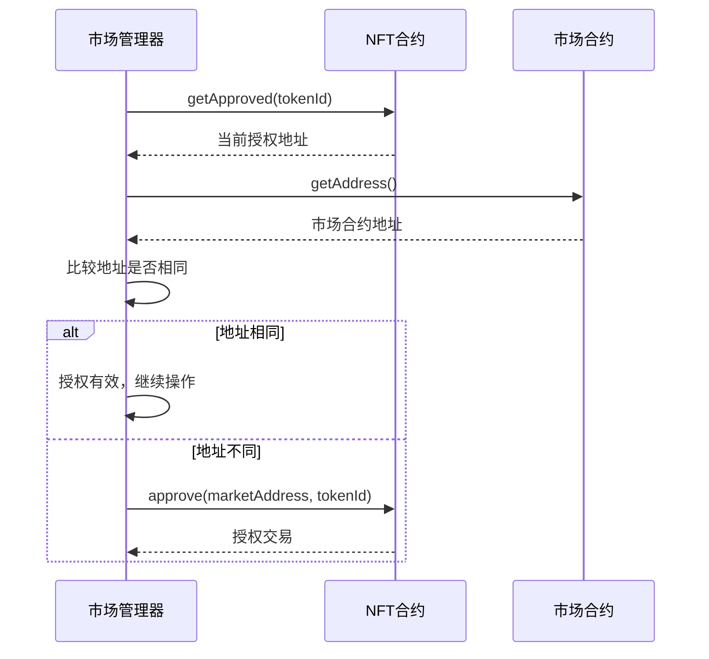

## 4. 错误处理机制

### 4.1 前端错误处理

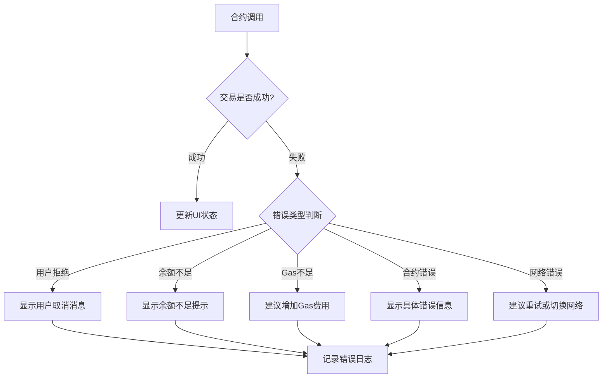

### 4.2 智能合约错误处理

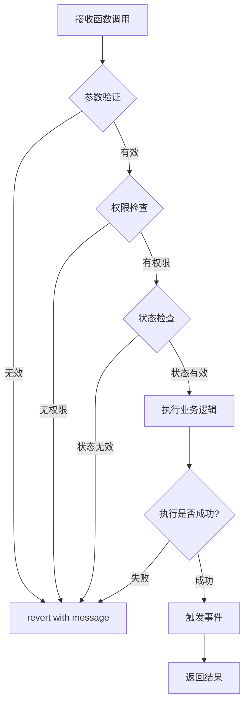

## 5. Gas费用管理

### 5.1 Gas估算流程

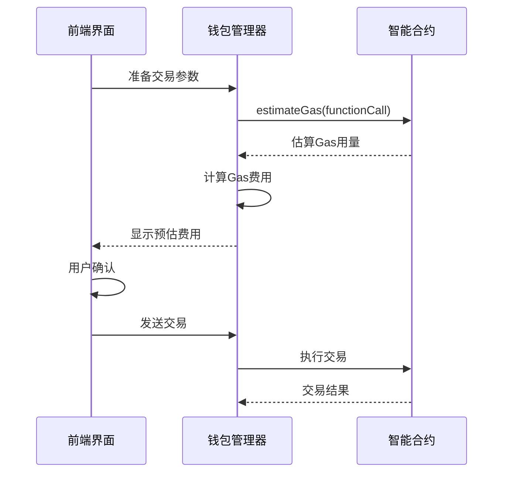

## 6. 状态管理

### 6.1 前端状态同步

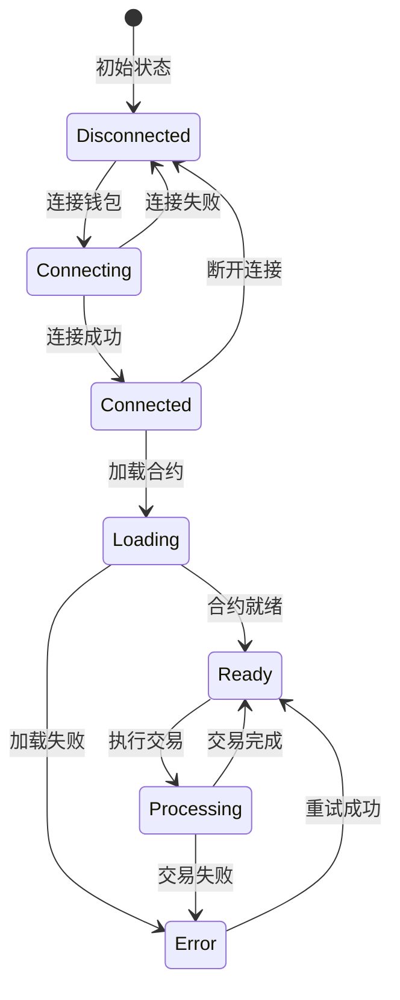

## 7. 核心类和方法说明

### 7.1 NFTManager类
- **validateFile()**: 验证上传文件的类型和大小
- **uploadFileToIPFS()**: 上传文件到IPFS存储
- **createMetadata()**: 创建NFT元数据JSON
- **generatePreview()**: 生成文件预览

### 7.2 MarketManager类
- **listNFT()**: 上架NFT到市场
- **buyNFT()**: 购买市场上的NFT
- **cancelListing()**: 取消NFT上架
- **validatePrice()**: 验证价格有效性

### 7.3 SharedContractManager类
- **initContracts()**: 初始化合约实例
- **getNFTContract()**: 获取NFT合约实例
- **getMarketContract()**: 获取市场合约实例
- **mintNFT()**: 调用NFT铸造功能

### 7.4 智能合约核心函数

#### MyNFT.sol
- **mint()**: 铸造新的NFT
- **setMintPrice()**: 设置铸造价格
- **setMintingEnabled()**: 控制铸造状态
- **tokensOfOwner()**: 获取用户拥有的所有NFT

#### NFTMarket.sol
- **listNFT()**: 上架NFT
- **buyNFT()**: 购买NFT
- **cancelListing()**: 取消上架
- **updateListingPrice()**: 更新上架价格

## 8. 安全考虑

### 8.1 重入攻击防护
- 使用OpenZeppelin的ReentrancyGuard
- 状态更新在外部调用之前完成
- 使用checks-effects-interactions模式

### 8.2 权限控制
- 所有权验证：确保只有NFT所有者可以上架
- 授权检查：确保市场合约有权限转移NFT
- 管理员权限：关键参数只能由合约所有者修改

### 8.3 输入验证
- 地址非零检查
- 价格范围验证
- 文件类型和大小限制
- 元数据格式验证

## 9. 使用示例

### 9.1 铸造NFT示例
```javascript
// 1. 验证文件
const validation = nftManager.validateFile(file);
if (!validation.valid) {
    throw new Error(validation.errors.join(', '));
}

// 2. 上传到IPFS
const uploadResult = await nftManager.uploadFileToIPFS(file, (progress) => {
    console.log(`上传进度: ${progress}%`);
});

// 3. 创建元数据
const metadata = nftManager.createMetadata(name, description, uploadResult.hash);

// 4. 上传元数据
const metadataResult = await nftManager.uploadJSONToIPFS(metadata);

// 5. 铸造NFT
const mintTx = await sharedContractManager.mintNFT(
    userAddress, 
    metadataResult.url, 
    mintPrice
);
```

### 9.2 上架NFT示例
```javascript
// 1. 验证价格
const priceValidation = await marketManager.validatePrice(price);
if (!priceValidation.valid) {
    throw new Error(priceValidation.errors.join(', '));
}

// 2. 上架NFT
const listResult = await marketManager.listNFT(tokenId, price, (progress, message) => {
    console.log(`${progress}%: ${message}`);
});

console.log('上架成功:', listResult.transactionHash);
```

## 10. 总结

本NFT合约交互系统通过分层架构设计，实现了完整的NFT生命周期管理：

1. **铸造阶段**：文件验证 → IPFS上传 → 元数据创建 → 合约铸造
2. **交易阶段**：授权检查 → 上架验证 → 市场交易 → 资金分配
3. **管理阶段**：状态同步 → 错误处理 → 安全防护 → 用户体验

系统具备完善的错误处理机制、安全防护措施和用户友好的交互体验，为NFT项目提供了可靠的技术基础。