# 钱包逻辑实现流程图

## 整体架构图


## 详细流程说明

### 1. 初始化阶段


### 2. 连接流程

```mermaid
sequenceDiagram
    participant U as 用户
    participant UI as SharedWalletUI
    participant WM as WalletManager
    participant MM as MetaMask
    participant BC as 区块链网络
    
    U->>UI: 点击连接钱包
    UI->>WM: connect()
    
    WM->>WM: 检查MetaMask安装
    alt MetaMask未安装
        WM-->>UI: 返回错误信息
        UI-->>U: 显示安装提示
    else MetaMask已安装
        WM->>MM: eth_requestAccounts
        MM-->>U: 显示授权弹窗
        U-->>MM: 用户授权
        MM-->>WM: 返回账户列表
        
        WM->>MM: 创建BrowserProvider
        WM->>MM: 获取Signer
        WM->>BC: 获取网络信息
        BC-->>WM: 返回chainId
        
        alt 网络不匹配
            WM->>MM: wallet_switchEthereumChain
            alt 网络不存在
                MM-->>WM: 错误码4902
                WM->>MM: wallet_addEthereumChain
            end
        end
        
        WM->>UI: 返回连接结果
        UI->>UI: updateWalletUI()
        UI-->>U: 显示连接成功
    end
```



### 3. 状态管理流程


### 4. 事件监听机制


### 5. UI更新流程


## 核心类和方法说明

### WalletManager 类

| 属性 | 说明 |
|------|------|
| `provider` | ethers.js BrowserProvider实例 |
| `signer` | 签名器实例，用于交易签名 |
| `userAddress` | 当前连接的用户地址 |
| `isConnected` | 连接状态标识 |
| `networkId` | 当前网络ID |
| `networkConfig` | 网络配置信息 |

| 方法 | 功能 |
|------|------|
| `connect()` | 连接钱包的主要方法 |
| `disconnect()` | 断开钱包连接 |
| `switchToTargetNetwork()` | 切换到目标网络 |
| `handleAccountChange()` | 处理账户变化 |
| `handleNetworkChange()` | 处理网络变化 |
| `updateUI()` | 更新用户界面 |

### SharedWalletUI 类

| 方法 | 功能 |
|------|------|
| `connectWallet()` | 统一的钱包连接接口 |
| `updateWalletUI()` | 统一的UI更新方法 |
| `setupEventListeners()` | 设置事件监听器 |
| `triggerCallbacks()` | 触发注册的回调函数 |

## 错误处理机制


## 配置管理集成


## 安全考虑

1. **权限验证**：每次操作前检查钱包连接状态
2. **网络验证**：确保在正确的区块链网络上操作
3. **错误处理**：完善的错误捕获和用户提示
4. **状态同步**：实时监听钱包状态变化
5. **配置管理**：统一的网络配置管理，避免硬编码

## 使用示例

```javascript
// 基本连接
const result = await walletManager.connect();
if (result.success) {
    console.log('连接成功:', result.address);
} else {
    console.error('连接失败:', result.error);
}

// 使用SharedWalletUI
const sharedUI = new SharedWalletUI(walletManager);
sharedUI.onConnect((result) => {
    console.log('钱包已连接:', result.address);
});

await sharedUI.connectWallet((message, type) => {
    console.log(`${type}: ${message}`);
});
```

这个流程图展示了NFT项目中钱包连接和管理的完整逻辑实现，包括初始化、连接、状态管理、事件监听、UI更新和错误处理等各个环节。